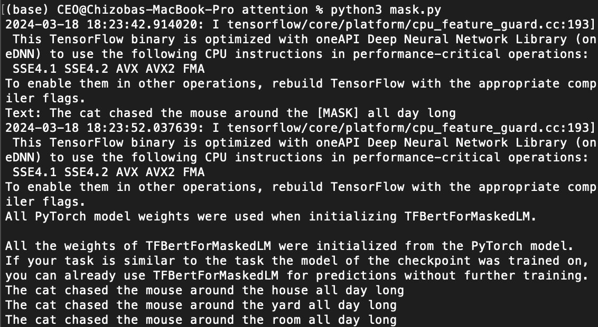
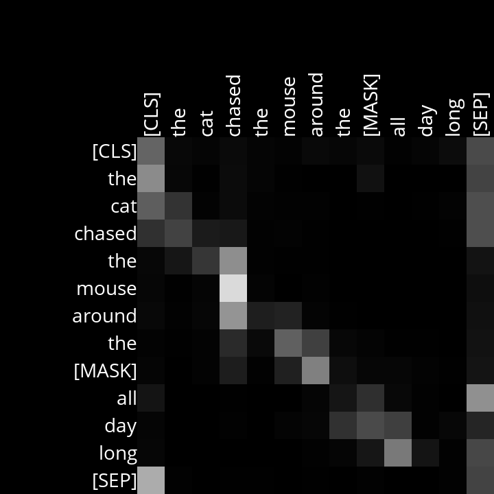
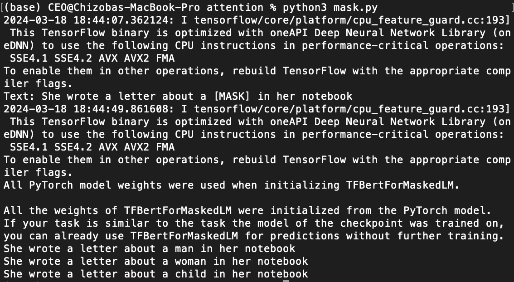
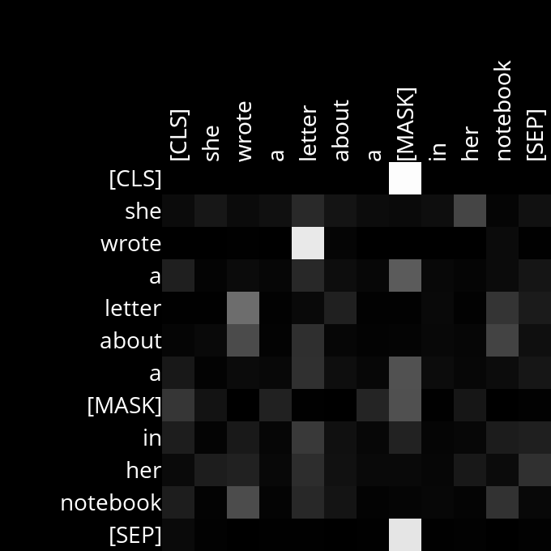
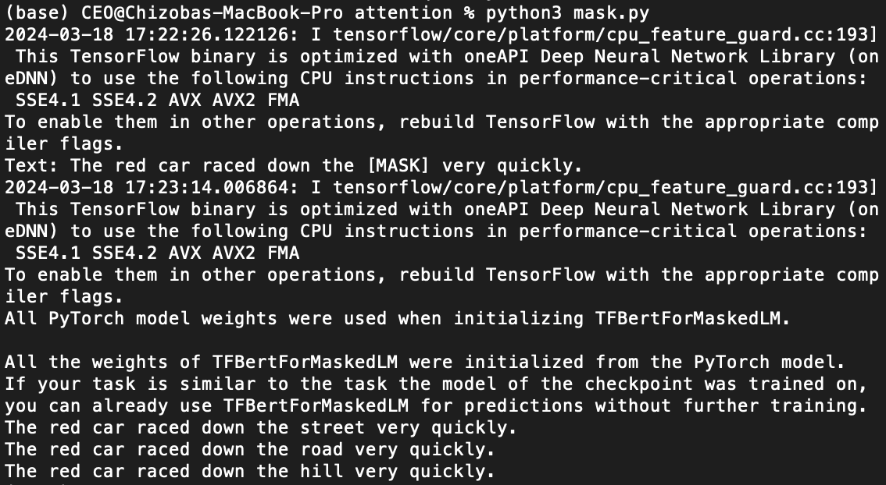
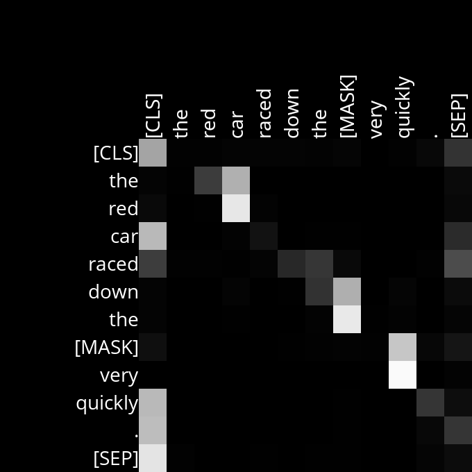
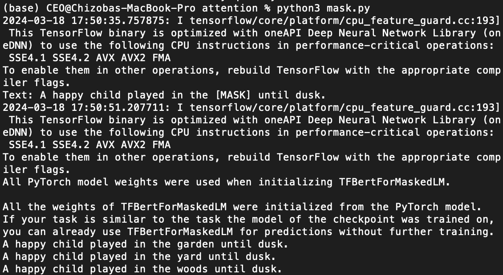
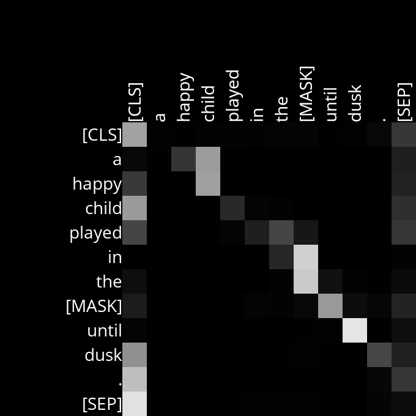

# Masked Language Model (`Bert`) Attention Head Visualizer
>_This repository focused on visualizing and analyzing BERT self-attention heads during masked language modeling._
   

# Background

One way to create language models is to build a Masked Language Model, where a language model is trained to predict a “masked” word that is missing from a sequence of text. [BERT](https://arxiv.org/abs/1810.04805) is a transformer-based language model developed by Google, and it was trained with this approach: the language model was trained to predict a masked word based on the surrounding context words.

BERT uses a transformer architecture and therefore uses an attention mechanism for understanding language. In the base BERT model, the transformer uses 12 layers, where each layer has 12 self-attention heads, for a total of 144 self-attention heads.

This project will involve two parts:

First, we’ll use the [`transformers` Python library](https://huggingface.co/docs/transformers/index), developed by AI software company Hugging Face, to write a program that uses BERT to predict masked words. The program will also generate diagrams visualizing attention scores, with one diagram generated for each of the 144 attention heads.

Second, we’ll analyze the diagrams generated by our program to try to understand what BERT’s attention heads might be paying attention to as it attempts to understand our natural language.
   

# Understanding

First, take a look at the `mask.py` program. In the `main` function, the user is first prompted for some text as input. The text input should contain a mask token `[MASK]` representing the word that our language model should try to predict. The function then uses an [`AutoTokenizer`](https://huggingface.co/docs/transformers/v4.31.0/en/model_doc/auto#transformers.AutoTokenizer) to take the input and split it into tokens.

In the BERT model, each distinct token has its own ID number. One ID, given by `tokenizer.mask_token_id`, corresponds to the `[MASK]` token. Most other tokens represent words, with some exceptions. The `[CLS]` token always appears at the beginning of a text sequence. The `[SEP]` token appears at the end of a text sequence and is used to separate sequences from each other. Sometimes a single word is split into multiple tokens: for example, BERT treats the word “intelligently” as two tokens: `intelligent` and `##ly`.

Next, we use an instance of [`TFBertForMaskedLM`](https://huggingface.co/docs/transformers/v4.31.0/en/model_doc/bert#transformers.TFBertForMaskedLM) to predict a masked token using the BERT language model. The input tokens (`inputs`) are passed into the model, and then we look for the top `K` output tokens. The original sequence is printed with the mask token replaced by each of the predicted output tokens.

Finally, the program calls the `visualize_attentions` function, which should generate diagrams of the attention values for the input sequence for each of BERT’s attention heads.

The `mask.py` program will predict the masked word and generate attention diagrams. These diagrams can give us some insight into what BERT has learned to pay attention to when trying to make sense of language.   

# Analysis: Attention Diagrams for Masked Language Model (Using BERT)

Upon implementation of `mask.py`, you should be able to predict masked words and generate attention diagrams. The second part of this project is to analyze those attention diagrams for sentences of your choosing to make inferences about what role specific attention heads play in the language understanding process. You’ll fill in your analysis in `analysis.md`.

*   Complete the `TODOs` in the `analysis.md`.
    *   You should describe at least two attention heads for which you’ve identified some relationship between words that the attention head appears to have learned. In each case, write a sentence or two describing what the head appears to be paying attention to and give at least two example sentences that you fed into the model in order to reach your conclusion.
    *   Attention heads can be noisy, so they won’t always have clear human interpretations. Sometimes they may attend to more than just the relationship you describe, and sometimes they won’t identify the relationship you describe for every sentence. That’s okay! The goal here is to make inferences about attention based on our human intuition for language, not necessarily to identify exactly what each attention head’s role is.
    *   You can look for any relationship between words you’re interested in. If looking for ideas, you might consider any of the following: the relationship between verbs and their [direct objects](https://en.wikipedia.org/wiki/Object_(grammar)), [prepositions](https://en.wikipedia.org/wiki/Preposition_and_postposition), [pronouns](https://en.wikipedia.org/wiki/Pronoun), [adjectives](https://en.wikipedia.org/wiki/Adjective), [determiners](https://en.wikipedia.org/wiki/Determiner), or tokens paying attention to the tokens that precede them.
  

## 1. VERB-OBJECT RELATIONSHIP

Example Sentences:
- "The cat chased the mouse around the [MASK] all day long."
- "She wrote a letter about a [MASK] in her notebook."  

### `Sentence 1: The cat chased the mouse around the [MASK] all day long.`
------

  

### Layer 4, Head 12
In this attention head, there seems to be a pattern of the token paying attention to the direct object of the verb in the sentence. For example, in the sentence "The cat chased the mouse around the [MASK] all day long," the token representing "mouse" pays the strongest attention to the token representing "chased," indicating that this attention head may be focusing on the relationship between the verb and its direct object.

  

  

### `Sentence 2: She wrote a letter about a [MASK] in her notebook.`
------

  

### Layer 1, Head 6
In this attention head, there seems to be a pattern of the token paying attention to the direct object of the verb in the sentence. For example, in the sentence "She wrote a letter about a [MASK] in her notebook," the token representing "wrote" pays the strongest attention to the token representing "letter," indicating that this attention head may be focusing on the relationship between the verb and its direct object.

  

    

## 2. NOUN-ADJECTIVE RELATIONSHIP

Example Sentences:
- "The red car raced down the [MASK] very quickly."
- "A happy child played in the [MASK] until dusk."  

### `Sentence 1: The red car raced down the [MASK] very quickly.`
---------

  

### Layer 4, Head 10
In this attention head, there appears to be a focus on the relationship between adjectives and the nouns they modify. For instance, in the sentence "The red car raced down the [MASK] very quickly," the adjective "red" pays the most attention to the noun "car," indicating that this attention head may be capturing the relationship between adjectives and the nouns they describe.

  

  

### `Sentence 2: A happy child played in the [MASK] until dusk.`
---------

  

### Layer 4, Head 10
In this attention head, there appears to be a focus on the relationship between adjectives and the nouns they modify. For instance, in the sentence "A happy child played in the [MASK] until dusk," the adjective "happy" pays the most attention to the noun "child," indicating that this attention head may be capturing the relationship between adjectives and the nouns they describe.

  

